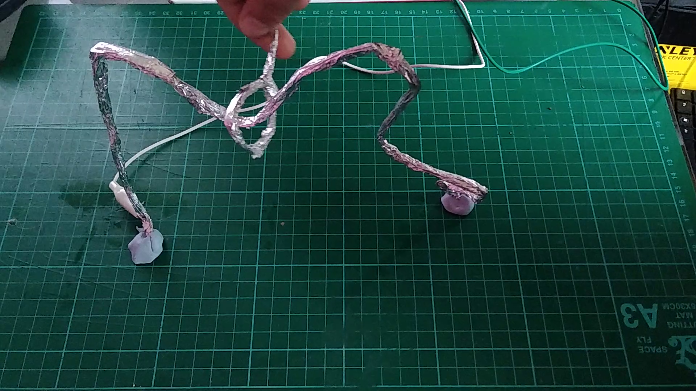

## Introduction

Add project description here. What will learners be making? Broadly what skills will they be learning?

### What you will make

--- no-print ---

<video width="640" height="360" controls>
<source src="images/showcase.mp4" type="video/mp4">
</video>

--- /no-print ---

--- print-only ---

--- /print-only ---

--- collapse ---
---
title: What you will need
---
### Hardware

+ A Raspberry Pi computer
+ A buzzer
+ 5 × pipe cleaners
+ 2 × M-F jumper wires
+ 2 × F-F jumper wires
+ 2 × crocodile clip wires
+ Aluminium foil
+ Plasticine or BluTack

### Software

+ Scratch 3 Desktop

--- /collapse ---

--- collapse ---
---
title: What you will learn
---

+ How to use a buzzer with a Raspberry Pi computer and Scratch
+ How to use a button to sound a buzzer
+ How to use a variable to keep a score

--- /collapse ---

--- collapse ---
---
title: Additional information for educators
---

You can download the completed project [here](http://rpf.io/p/en/rpi-wire-loop-game-scratch-get){:target="_blank"}.

If you need to print this project, please use the [printer-friendly version](https://projects.raspberrypi.org/en/projects/rpi-wire-loop-game-scratch/print){:target="_blank"}.

--- /collapse ---

