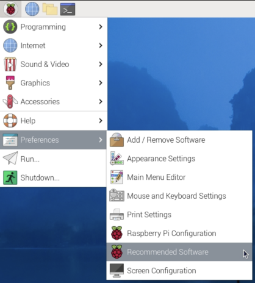
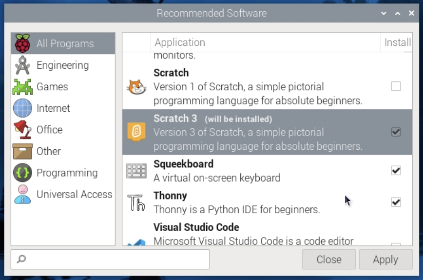

## You will make

Make a classic [wire loop game](https://en.wikipedia.org/wiki/Wire_loop_game), using simple materials and a Raspberry Pi Computer!

--- no-print ---

<video width="640" height="360" controls>
<source src="images/showcase.mp4" type="video/mp4">
</video>

--- /no-print ---

--- print-only ---

--- /print-only ---

## What you will need

### Hardware
+ A Raspberry Pi computer
+ A buzzer
+ 5 × pipe cleaners
+ 2 × socket-pin jumper wires
+ 2 × socket-socket jumper wires
+ 2 × crocodile clip wires
+ Aluminium foil
+ Plasticine or BluTack

### Software
+ Scratch 3 Desktop - This project can not be completed using the online Scratch 3 editor, and must be completed using a Raspberry Pi with the desktop version installed. 

--- collapse ---
---
title: Installing Scratch 3 desktop
---

Click on the Raspberry Pi logo, then **Preferences**, then **Recommended software**.

Find **Scratch 3** in the list of software, tick the box and then click **Apply** to install it.

--- /collapse ---