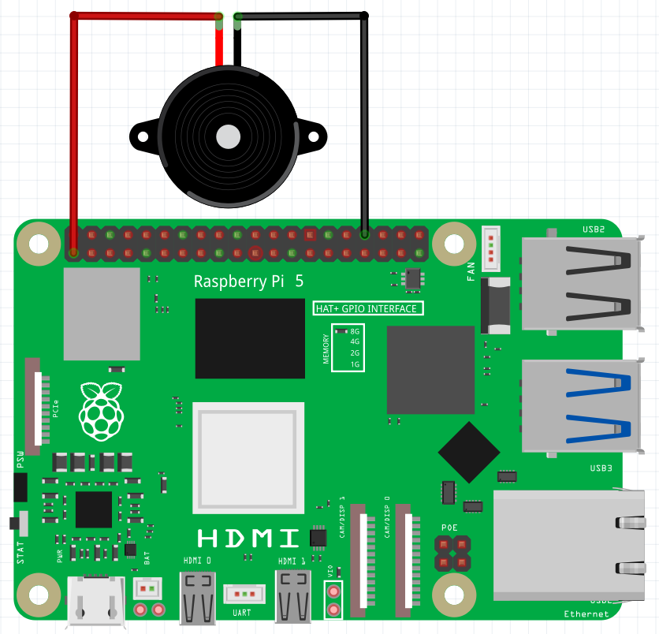
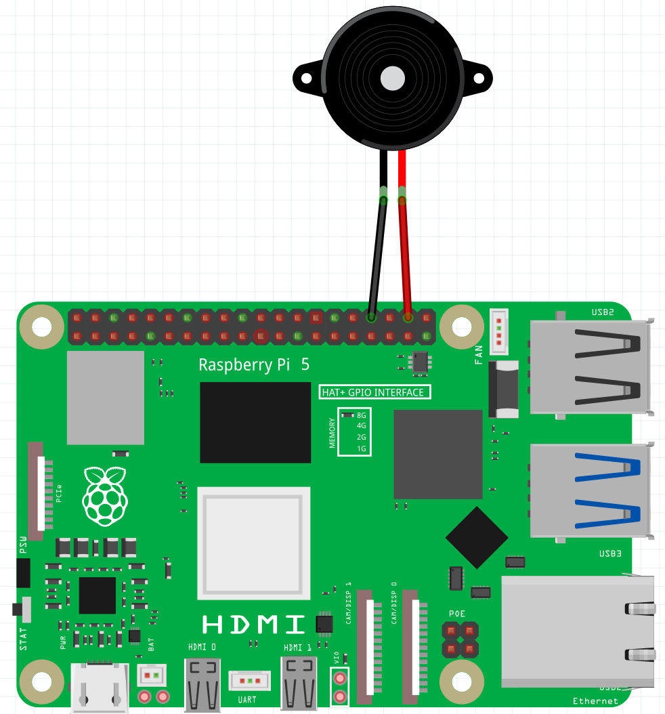

## Wire and test a buzzer

Wire up a buzzer and control it with Scratch.

An active buzzer works just like an LED. It will make a sound when it is turned on and the sound will stop when the buzzer is turned off.

--- task ---

Use two socket-socket jumper wires to attach your buzzer to your Raspberry Pi device. The long leg of the buzzer must be wired to **3V3** and the short leg of the buzzer should be wired to a **GND** (ground) pin. The buzzer should sound straight away, so you know that it works.



--- /task ---

--- task ---

Move the wire from the **3V3** pin to **GP20** as shown in the diagram below, and the buzzer should stop sounding.



--- /task ---

--- task ---

Open Scratch Desktop on your Raspberry Pi and add the Raspberry Pi `Simple Electronics`{:class="block3extensions"} extension.

--- /task ---

--- task ---

From the Raspberry Pi `Simple Electronics`{:class="block3extensions"} extension, find `toggle LED 0`{:class='block3extension'} in the menu, and use the drop-down menu to change `0` to `20`.

```blocks3
toggle LED (20 v) ::extension
```

--- /task ---

--- task ---

Click on the block and your buzzer should sound. Click again and your buzzer should turn off. 

It doesn't matter that the block says LED, because buzzers and LEDs work in the same way. They're either on or off. 

--- /task ---

--- save ---
