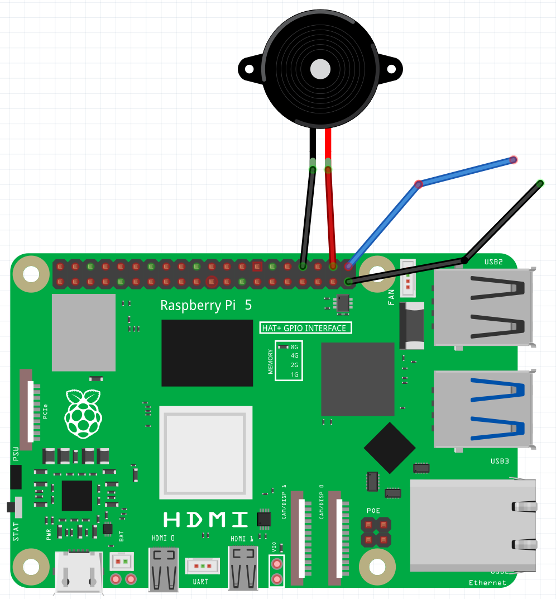

## Add a button

In this step, you will add a simple button, that can be used to control the buzzer.

--- task ---

Add a M-F jumper lead to `GP21` and another to a second `GND` pin



--- /task ---

--- task ---

From the **Raspberry Pi Simple Electronics** extension, add the following blocks to control your buzzer.

```blocks3
when button (21 v) [pressed v] ::extension hat
turn LED (20 v) [on v] ::extension

when button (21 v) [released v] ::extension hat
turn LED (20 v) [off v] ::extension

--- /task ---

--- task ---

Run your code and then touch the M-F jumper leads together. The buzzer should sound. When you take them apart the buzzer should stop

--- /task ---