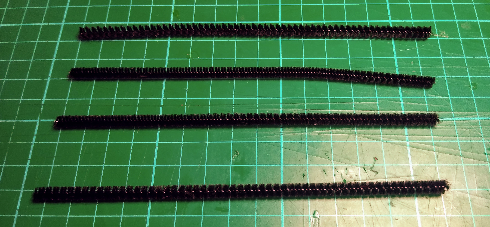
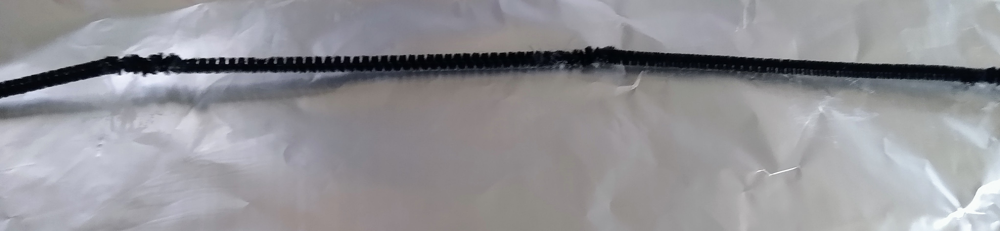
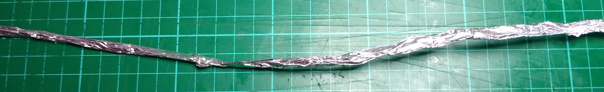
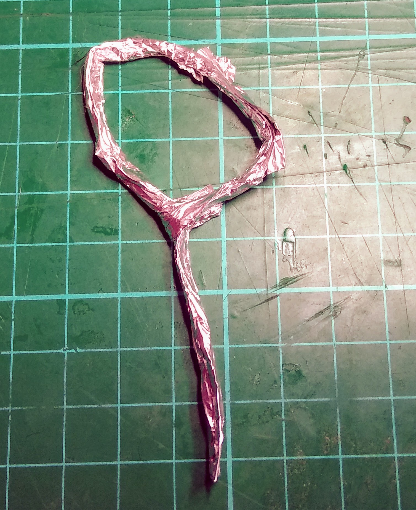
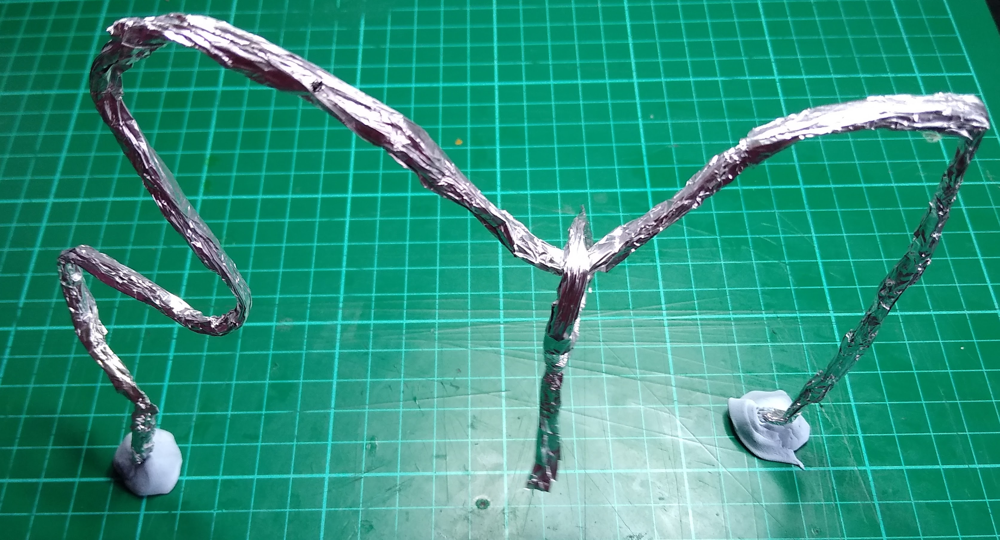
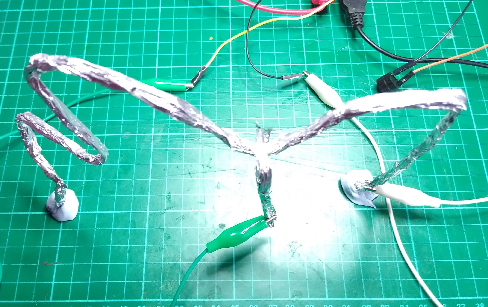

## Build your wire loop game

In this step you will build the physical wire loop game using your existing Scratch code.

--- task ---

Take 4 pipe cleaners.

--- /task ---

--- task ---

Twist together the ends of the pipe cleaners, so that the four are attached. Then place them on a square of aluminium foil.

--- /task ---

--- task ---

Wrap the pipe cleaners in the foil, so that they are covered from end to end.

--- /task ---

--- task ---

Take another pipe cleaner, wrap it in foil and then bend it into a loop.

--- /task ---

--- task ---

Take the long wrapped set of pipe cleaners and bend them into an interesting shape. You can use Plasticine or BluTack to hold the end of the wire in place. Thread the wire loop you have made onto the long wire.

--- /task ---

--- task ---

Use a crocodile clip lead to attach a base of the long wire to one of the M-F jumper leads, and another crocodile clip lead to attach the wire loop to the other M-F jumper lead.

--- /task ---

--- task ---

Run your Scratch program, and then try to move the wire loop along the long wire without touching it. Each time it touches, the buzzer should sound.

--- /task ---